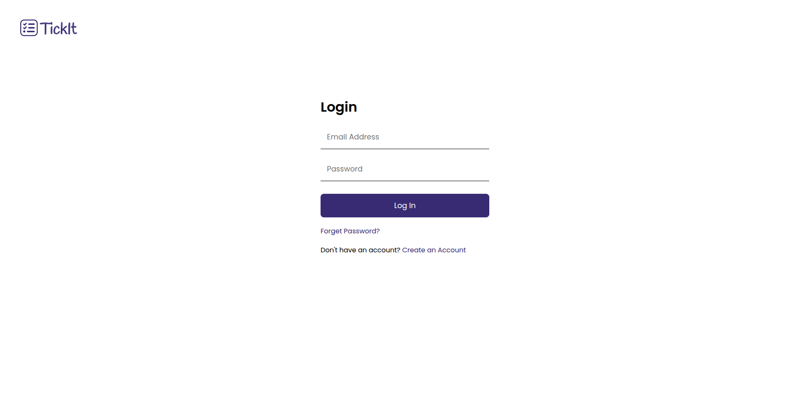
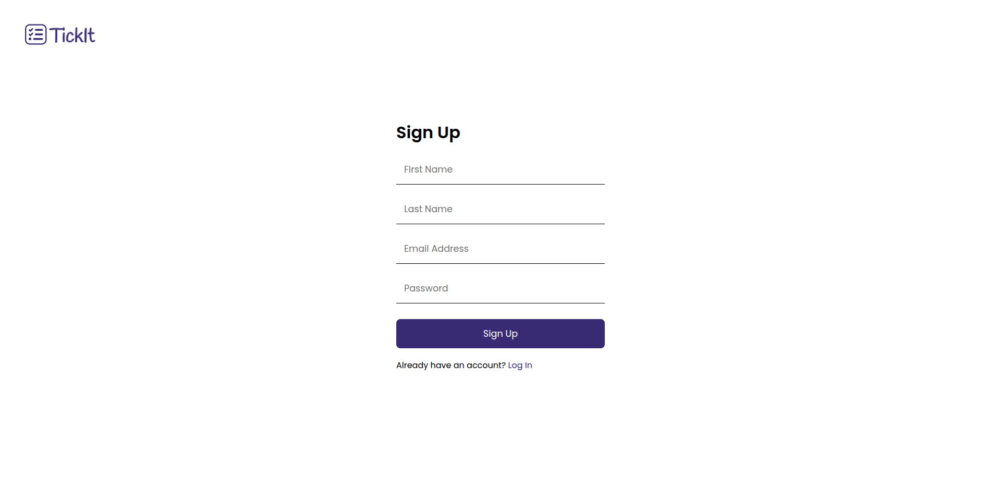
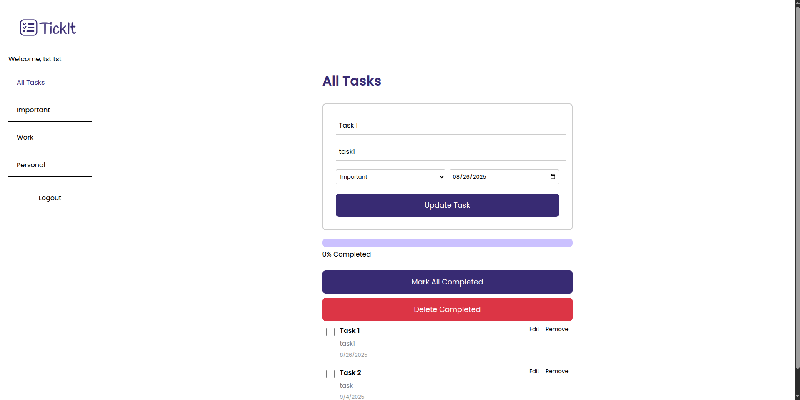

# Todo List Application

A full-stack web application for managing personal tasks and to-dos. Built with Spring Boot backend and React frontend, featuring user authentication, task management, and filtering capabilities.

## 🚀 Features

- **User Authentication**: Secure registration, login, and password reset functionality
- **Task Management**: Create, read, update, and delete tasks
- **Task Filtering**: Filter tasks by categories (All, Important, Work, Personal)
- **Task Status**: Mark tasks as complete/incomplete with progress tracking
- **User-Specific Tasks**: Each user can only see and manage their own tasks
- **Responsive Design**: Clean and intuitive user interface

## 🛠️ Technology Stack

### Backend
- **Spring Boot** - Java framework for building the REST API
- **Spring Data JPA** - For database operations
- **SQL Server** - Database for storing users and tasks
- **Maven** - Dependency management

### Frontend
- **React** - Frontend JavaScript library
- **React Router** - For navigation and routing
- **CSS3** - Custom styling
- **Axios** - HTTP client for API calls

## 📋 Prerequisites

Before running this application, make sure you have the following installed:

- **Java 17 or higher**
- **Node.js 16 or higher**
- **npm or yarn**
- **SQL Server** (Microsoft SQL Server)
- **Maven** (for building the backend)

## 🗄️ Database Setup

### 1. Install and Start SQL Server

**On Linux (Ubuntu/Debian):**
```bash
# Start SQL Server service
sudo systemctl start mssql-server

# Check status
sudo systemctl status mssql-server

# Enable auto-start on boot (optional)
sudo systemctl enable mssql-server
```

**On Windows:**
- Start SQL Server through SQL Server Configuration Manager
- Or use Services (services.msc) to start SQL Server service

**On macOS:**
```bash
# Using Docker (recommended for macOS)
docker run -e 'ACCEPT_EULA=Y' -e 'SA_PASSWORD=YourPassword123!' \
   -p 1433:1433 --name sql-server \
   -d mcr.microsoft.com/mssql/server:2019-latest
```

### 2. Create Database
```sql
-- Connect to SQL Server and create database
CREATE DATABASE bd;
```

### 3. Update Database Configuration
Update the database credentials in `src/main/resources/application.properties`:
```properties
spring.datasource.url=jdbc:sqlserver://localhost:1433;databaseName=bd;encrypt=false
spring.datasource.username=sa
spring.datasource.password=YourPassword123!
```

## 🚀 Installation & Running

### Method 1: Using Individual Commands

#### Backend Setup
```bash
# Navigate to the project root directory
cd todo-list-app

# Install dependencies and run the Spring Boot application
mvn clean install
mvn spring-boot:run

# The backend will be available at http://localhost:8080
```

#### Frontend Setup
```bash
# Navigate to the frontend directory
cd todo-frontend

# Install dependencies
npm install

# Start the development server
npm start

# The frontend will be available at http://localhost:3000
```

## 🌐 API Endpoints

### User Authentication
- `POST /api/users/register` - Register a new user
- `POST /api/users/login` - User login
- `PUT /api/users/forget-password` - Reset password
- `POST /api/users/logout` - User logout

### Todo Management
- `GET /api/todos/user/{userId}` - Get all todos for a user
- `POST /api/todos/user/{userId}` - Create a new todo
- `PUT /api/todos/{todoId}` - Update a todo
- `DELETE /api/todos/{todoId}` - Delete a todo
- `PUT /api/todos/{todoId}/toggle` - Toggle todo completion status
- `GET /api/todos/user/{userId}/completed` - Get completed todos
- `GET /api/todos/user/{userId}/not-completed` - Get incomplete todos

## 📱 Usage

1. **Register/Login**: Create a new account or login with existing credentials
2. **Add Tasks**: Use the form to create new tasks with title, description, label, and due date
3. **Manage Tasks**: 
   - Click the checkbox to mark tasks as complete
   - Use the edit button to modify tasks
   - Use the delete button to remove tasks
4. **Filter Tasks**: Use the sidebar to filter tasks by category (All, Important, Work, Personal)
5. **Track Progress**: View your completion progress in the progress bar

## 📁 Project Structure

```
todo-list-app/
├── src/main/java/com/example/todolist/
│   ├── controllers/          # REST API controllers
│   ├── model/               # Entity classes
│   ├── repos/               # Repository interfaces
│   ├── services/            # Business logic services
│   └── TodoListApplication.java
├── src/main/resources/
│   ├── application.properties
│   └── static/
├── todo-frontend/
│   ├── src/
│   │   ├── components/      # React components
│   │   ├── App.js
│   │   └── index.js
│   ├── public/
│   └── package.json
└── README.md
```

## 🎨 Screenshots

### Login Page


### Registration Page


### Task Management


## 🔧 Configuration

### Backend Configuration (`application.properties`)
```properties
# Application name
spring.application.name=TodoList

# Database configuration
spring.datasource.url=jdbc:sqlserver://localhost:1433;databaseName=bd;encrypt=false
spring.datasource.username=sa
spring.datasource.password=YourPassword123!
spring.datasource.driver-class-name=com.microsoft.sqlserver.jdbc.SQLServerDriver

# JPA/Hibernate configuration
spring.jpa.hibernate.ddl-auto=update
spring.jpa.show-sql=true
spring.jpa.properties.hibernate.dialect=org.hibernate.dialect.SQLServerDialect
spring.jpa.properties.hibernate.format_sql=true

# Server configuration
server.error.include-message=always
spring.main.allow-bean-definition-overriding=true
```
